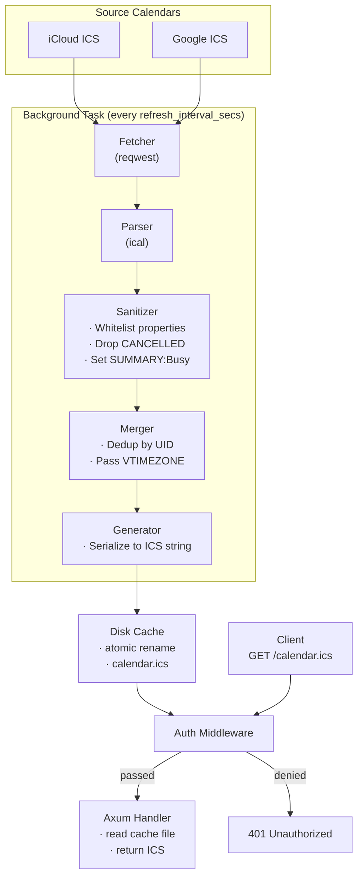

# Calendar Proxy — Architecture

## 1. High-Level Design

## 2. Module Map

### 2.1 `main.rs`
- Entry point and lifecycle orchestrator
- Wiring: config → cache → auth → router → server
- Signal handling for graceful shutdown

### 2.2 `config.rs`
- YAML deserialization for all configuration
- Auth mode validation (mutual exclusivity check)
- Simple struct types; no logic beyond parsing + validation

### 2.3 `calendar.rs`
- Contains all ICS-related logic
- **Parser**: wraps the `ical` crate, extracts VEVENT and VTIMEZONE
- **Sanitizer**: whitelist-based property filtering
- **Generator**: produces valid ICS output string
- **Domain types**: `SanitizedEvent`, `SanitizedCalendar`

### 2.4 `cache.rs`
- Disk-based cache with atomic file swap
- Background refresh loop (tokio::spawn)
- Parallel ICS fetching with retry + exponential backoff

### 2.5 `auth.rs`
- Axum middleware for all three auth modes
- Query param extraction, custom header extraction, Basic auth parsing
- Stateless — configured once at startup, no ongoing auth lookups

## 3. Design Decisions

### 3.1 Why Rust?

- **Memory safety**: No buffer overflows, use-after-free, or null pointer issues
- **Performance**: Native compilation, minimal overhead per request
- **Container-friendly**: Static binary with `rustls` avoids OpenSSL dependency,
  resulting in minimal container image size
- **Type safety**: The compiler catches config validation, parsing errors, and
  concurrency issues at compile time

### 3.2 Why Disk-Based Cache Instead of In-Memory?

**Decision:** Store the merged ICS on disk and serve it by reading the file on each request,
rather than keeping it in an `Arc<RwLock<String>>`.

**Rationale:**
- `rename()` is an atomic syscall on POSIX systems, providing lock-free consistency
- No mutex contention — readers never block writers, writers never block readers
- The ICS file is small (typically KBs, rarely MBs); OS page cache makes reads fast
- Simpler concurrency model — no need for `Arc<RwLock<>>` or similar synchronization
- If the process restarts, the cache file persists (useful for quick restarts)
- Easier to debug — the cached file is visible on disk with `cat`

**Trade-off:** File I/O on every request adds ~microsecond latency vs. in-memory, but
this is negligible for a calendar feed that's polled every few minutes.

### 3.3 Why Whitelist Sanitization Over Blacklist?

**Decision:** Explicitly list the properties to KEEP; strip everything else.

**Rationale:**
- Unknown properties are automatically stripped — no need to update a blocklist for
  every new calendar provider's custom `X-*` property
- Security by default — the safest approach is "deny all, allow specific"
- More maintainable — the whitelist is short and stable (10 properties); a blocklist
  would grow as providers add new properties
- RFC 5545 allows arbitrary `X-*` properties; a blocklist can never be complete

### 3.4 Why Axum?

**Decision:** Use `axum` for the HTTP server.

**Rationale:**
- Built on `tower` and `tokio` — the standard Rust async ecosystem
- First-class support for async handlers, middleware, and graceful shutdown
- `Router` type makes it easy to compose auth middleware with route handlers
- Good ergonomics for extracting query parameters, headers, and request state
- Widely used and well-maintained

### 3.5 Why Passthrough RRULE Instead of Expansion?

**Decision:** Pass recurrence rules through to the client without expanding them.

**Rationale:**
- Expansion is computationally expensive and error-prone (infinite recurring events,
  exception dates, multiple rules, etc.)
- Most calendar clients (Apple Calendar, Google Calendar, Outlook) handle RRULE
  expansion correctly on their side
- Keeps the output file small
- Avoids ambiguity about which instances to expand (e.g., no end date → infinite)

### 3.6 Why Keep VTIMEZONE?

**Decision:** Preserve VTIMEZONE blocks from source calendars in the output.

**Rationale:**
- Without timezone definitions, floating times (no UTC offset) are ambiguous
- Different timezones have different DST rules; the client needs the VTIMEZONE to
  display events correctly
- VTIMEZONE blocks contain no personal information — they're standard IANA timezone
  definitions

### 3.7 Why Paketo Buildpacks?

**Decision:** Use `paketo-community/rust` buildpack with the `static` run image.

**Rationale:**
- No Dockerfile required — the buildpack detects `Cargo.toml` and builds automatically
- Bundles `tini` for correct PID 1 behavior in containers
- The `static` run image is minimal (only `tzdata` + `ca-certificates` needed)
- Consistent, reproducible builds across environments
- Supports multi-architecture builds

### 3.8 Why Three Separate Auth Modes?

**Decision:** Support query param token, custom header token, and basic auth as mutually
exclusive options.

**Rationale:**
- Query param tokens are simplest for calendar clients that only support URL-based auth
- Custom headers avoid token leakage in URL logs (more secure)
- Basic auth is universally supported by HTTP clients
- Mutual exclusivity avoids ambiguity about which auth mechanism takes precedence
- The mode is validated at startup, failing fast on misconfiguration

### 3.9 Why Configurable VALARM Passthrough?

**Decision:** Strip VALARM components by default, with an opt-in `passthrough.alarms`
config option.

**Rationale:**
- VALARMs contain privacy-sensitive information (DESCRIPTION duplicates event titles,
  TRIGGER offsets reveal event categorization, ATTACH leaks platform)
- However, alarms are functionally important — users may want to be notified of
  events even when the feed is anonymized
- The compromise: allow preservation but sanitize DESCRIPTION to `"Reminder"` and
  SUMMARY to `"Calendar Alert"`, and whitelist only the minimum properties needed to
  fire an alarm (TRIGGER, ACTION, DURATION, REPEAT)
- Per-calendar override allows selective preservation (e.g., alarms on a personal
  calendar but not a shared work calendar)

### 3.10 Why Respect TRANSP:TRANSPARENT?

**Decision:** Pass through the `TRANSP` property unchanged. If the source event has
`TRANSP:TRANSPARENT`, the output event will also have it, making it show as "Free"
in the consuming calendar.

**Rationale:**
- The calendar owner deliberately marked certain events as non-blocking
- Our role is to anonymize, not to change semantics
- Consumers of the feed (e.g., colleagues checking availability) should see the same
  busy/free status the owner intended

## 4. Security Considerations

### 4.1 Auth Token Handling
- Auth tokens are loaded from the config file at startup only
- They are stored in memory for the lifetime of the process
- The config file should have restricted permissions (e.g., `chmod 600`)
- Token via query param may appear in access logs; custom header or basic auth
  preferred for production

### 4.2 ICS Property Leakage
- Whitelist approach ensures no unknown properties leak
- Special attention given to `X-*` properties, which calendar providers use
  extensively for non-standard data
- `VALARM` components are stripped entirely — `TRIGGER` offset (e.g., `-PT15M` vs `-P1DT9H`) varies by event type and can be used to infer categories. `DESCRIPTION` inside an alarm often redundantly duplicates the event title. `ACTION`, `DURATION`, `REPEAT`, and multiple alarms per event all leak behavioral patterns.
- `CREATED`/`LAST-MODIFIED`/`DTSTAMP` are stripped (could reveal when you make changes)

### 4.3 TLS
- `reqwest` uses `rustls` (not OpenSSL) — compatible with the `static` run image
- All source calendar fetches use HTTPS (enforced by `reqwest` defaults)
- The output feed is served over whatever transport the deployment provides
  (typically HTTPS via a reverse proxy)

### 4.4 CI/CD Security
- GitHub Actions use `persist-credentials: false` on checkout
- Minimum required permissions per workflow (`contents: read` for CI,
  `contents: write` + `packages: write` for release)
- No third-party actions beyond `dtolnay/rust-toolchain` (Rust team) and
  `buildpacks/github-actions` (CNCF project)
- `GITHUB_TOKEN` is used with least-privilege permissions

## 5. Testing Strategy

### 5.1 Unit Tests
- Pure function tests for ICS parsing/sanitizing/generation
- Config validation edge cases
- Auth header parsing and validation
- Mock HTTP server for fetcher tests

### 5.2 Integration Tests
- Full server startup with test config
- Auth middleware end-to-end
- Cache atomicity verification

### 5.3 Test Fixtures
- Synthetic ICS files covering:
  - Simple timed events
  - All-day events (`VALUE=DATE`)
  - Recurring events (RRULE, EXDATE, RDATE)
  - VTIMEZONE blocks
  - CANCELLED events
  - TRANSP:TRANSPARENT events
  - Various TZID values
  - X-* custom properties (to verify stripping)
  - Malformed ICS (to verify graceful handling)

### 5.4 Coverage Target
- Minimum 80% line coverage
- Focus on: calendar.rs (parsing, sanitization, generation), auth.rs (all modes),
  config.rs (validation)
